# StackChan 小狗行为引擎

基于 [M5Stack StackChan](https://github.com/stack-chan/stack-chan) 桌面机器人的**小狗行为启发情感表达系统**。小狗会追踪你的脸、被摸头会"贴贴"、能听懂你说话并用屏幕按钮动画回应、认得手势、还会陪你玩捉迷藏、到点提醒你喝水吃饭。

技术基座是 [zziying/stackchan-openapi](https://github.com/zziying/stackchan-openapi) 的 HTTP API 架构：ESP32 只负责硬件执行，所有 AI/行为决策都在电脑上跑。

## 架构

```
电脑（大脑）                                    StackChan（身体，ESP32-S3）
┌─────────────────────────────┐                ┌──────────────────────────┐
│ puppy_engine_v4.py（状态机）  │   WiFi HTTP    │  舵机（水平/俯仰）        │
│  ├─ MediaPipe 人脸/手势检测   │ ─────────────▶ │  表情屏幕（自定义狗脸）    │
│  ├─ FunASR 语音识别 (STT)    │ ◀───────────── │  摄像头（GC0308）         │
│  ├─ DeepSeek LLM（意图/回复） │                │  触摸传感器（头顶3区+屏幕）│
│  ├─ animalese 拟声词合成     │                │  麦克风 / 扬声器           │
│  └─ 无线麦克风采集（本地）    │                │  RGB LED                  │
└─────────────────────────────┘                └──────────────────────────┘
```

电脑和 StackChan 通过同一个 WiFi 热点通信；StackChan 暴露一组 HTTP 接口（`/face`、`/servo`、`/touch`、`/camera`、`/play`、`/stream`、`/led`、`/status` 等），电脑端的状态机负责"该做什么"，ESP32 只管"怎么执行"。

## 状态机一览

整个行为引擎用 [Mermaid](https://mermaid.js.org/) 画了一份完整的状态流转图，涵盖语音/视觉/触摸/时间四类触发各自会走到哪个状态，包括这里没有展开讲的所有细节分支：



其中两个比较好玩的功能：

1. **捉迷藏**：通过语音说"我们来玩捉迷藏吧"触发。流程是：把要藏起来的物品放在小狗摄像头前让它"看一眼"→ 小狗报告识别到的物品名称；如果识别错了，有一小段窗口期可以说"不是这个"，它会重新看一次 → 确认无误后小狗"闭眼"并倒数 → 倒数结束后转动舵机在房间里扫描寻找目标。
2. **装死**：摸一下屏幕触发"贴贴"反应之后，会进入约 15 秒的手势识别窗口期。在这段时间内，在设备摄像头前方约 5 厘米处比出"手指枪"的手势，即可触发小狗的"装死"状态；双击头顶可以把它唤醒。

### 演示视频

<table>
<tr>
<td width="50%">

<video src="https://github.com/dawnsyo-blip/puppy-stackchan/releases/download/demo-videos/IMG_2890.MOV" controls width="100%"></video>

语音对话演示：小狗用 animalese 拟声词回应

</td>
<td width="50%">

<video src="https://github.com/dawnsyo-blip/puppy-stackchan/releases/download/demo-videos/IMG_2885.MOV" controls width="100%"></video>

手指枪手势触发"装死"状态

</td>
</tr>
</table>

### 使用须知

- **语音对话依赖你自己接入的大语言模型**（推理模型或非推理模型均可，DeepSeek、其他兼容 API 都行）——没有配置的话，人脸追踪、触摸反应等其它功能不受影响，但小狗听不懂你在说什么。想让"喝水/出去玩"提醒带上天气相关的关键词，还需要接入一个天气 API（当前用的是和风天气）；这两者都是可选增强，未配置时会自动降级成固定文案，不影响其它功能运行。
- **手势识别（"手指枪→装死"等）本身是纯本地计算**，靠的是 MediaPipe 的手部关键点检测模型，只需要下载一次模型文件，不需要任何 API key。捉迷藏游戏里的物品识别可以选择性接入一个视觉大模型（可以用 Qwen-VL）来提升准确度，但不接入也能跑，退化成基于颜色直方图的简单匹配。
- **语音唤醒目前是基于音量阈值触发的**，建议使用一个连接电脑的外接麦克风来对话，减少环境噪音（尤其是舵机转动声）的干扰；也可以改用机身自带麦克风，但识别准确率可能会明显下降。

## 硬件

- M5Stack StackChan 套件（CoreS3，ESP32-S3）：GC0308 摄像头、双麦克风、扬声器、2 个舵机（水平/俯仰）、头顶触摸传感器 + 触屏、RGB LED。
- 一台能跑 Python 的电脑（Windows/macOS/Linux 均可），建议带 GPU 但非必需。
- 一个无线麦克风（USB 接收器，供电脑采集语音用）。
- 电脑和 StackChan 需要在同一个 WiFi 网络下（推荐用电脑开热点）。

## 快速开始

### 1. 烧录固件

```bash
# 复制并填写你自己的 WiFi/IP 配置
cp firmware/config.h.example firmware/config.h
# 编辑 firmware/config.h 填入 WIFI_SSID / WIFI_PASSWORD / 电脑 IP 等

arduino-cli compile --fqbn m5stack:esp32:m5stack_cores3 firmware
arduino-cli upload --fqbn m5stack:esp32:m5stack_cores3 --port <你的串口> firmware
```

### 2. 配置电脑端

```bash
conda create -n stackchan python=3.10
conda activate stackchan
pip install requests numpy opencv-python mediapipe sounddevice scipy \
            funasr torch torchaudio pypinyin

# 复制并填写你自己的 API key（均为可选增强，缺失时会自动降级/跳过对应功能）
cp .env.example .env
```

需要在 `host/puppy_engine_v4.py` 顶部把 `BASE_URL`（StackChan 的 IP）、`COMPUTER_IP`（电脑在这个 WiFi 下的 IP）改成你自己的实际地址。

### 3. 运行

```bash
python host/puppy_engine_v4.py
```

首次运行会自动下载 `animalese.wav`（字母拟声词音频库）和 FunASR 的语音模型，需要联网。`host/hand_landmarker.task`（MediaPipe 手势检测模型）需要手动下载一次：

```bash
curl -o host/hand_landmarker.task \
  "https://storage.googleapis.com/mediapipe-models/hand_landmarker/hand_landmarker/float16/1/hand_landmarker.task"
```

## 项目结构

```
firmware/
├── firmware.ino          # 主固件：HTTP API 服务器 + 表情渲染
├── PuppyFace.h            # 自定义小狗表情组件（眼睛/鼻子/耳朵）
├── config.h.example       # WiFi/网络配置模板
└── expr_preview/          # 设计新表情用的独立最小 sketch

host/
└── puppy_engine_v4.py     # 行为状态机（人脸/手势检测、触摸、语音、状态机主循环）
```

## 致谢

- 硬件与固件基座：[stack-chan](https://github.com/stack-chan/stack-chan)、[zziying/stackchan-openapi](https://github.com/zziying/stackchan-openapi)
- 拟声词语音合成算法参考：[animalese.js](https://github.com/Acedio/animalese.js)
