# StackChan Puppy Behavior Engine

A **dog-behavior-inspired emotional expression system** built on the [M5Stack StackChan](https://github.com/stack-chan/stack-chan) desktop robot. The puppy tracks your face, gives a little "nuzzle" reaction when you touch its screen, understands what you say and answers back with on-screen button animations, recognizes hand gestures, plays hide-and-seek with you, and reminds you to drink water or eat on schedule.

It's built on top of [zziying/stackchan-openapi](https://github.com/zziying/stackchan-openapi)'s HTTP API architecture: the ESP32 only handles hardware execution, while all the AI/behavior decisions run on a host computer.

## Architecture

```
Computer (the brain)                            StackChan (the body, ESP32-S3)
┌─────────────────────────────┐                ┌──────────────────────────┐
│ puppy_engine_v4.py (FSM)     │   WiFi HTTP    │  Servos (yaw/pitch)      │
│  ├─ MediaPipe face/hand      │ ─────────────▶ │  Expression screen        │
│  ├─ FunASR speech-to-text    │ ◀───────────── │  Camera (GC0308)          │
│  ├─ DeepSeek LLM (intent)    │                │  Touch sensors (head+screen)│
│  ├─ animalese speech synth   │                │  Microphone / speaker      │
│  └─ local wireless mic input │                │  RGB LED                  │
└─────────────────────────────┘                └──────────────────────────┘
```

The computer and StackChan talk over the same WiFi hotspot; StackChan exposes a set of HTTP endpoints (`/face`, `/servo`, `/touch`, `/camera`, `/play`, `/stream`, `/led`, `/status`, etc.). The host-side state machine decides *what* to do, and the ESP32 only handles *how* to execute it.

## State Machine Overview

The behavior engine is built around a dozen or so states — **Idle, Happy, Excited, Sleepy, Privacy, Curious, Thinking, Sorry, Dizzy, Play Dead, Angry, Hide-and-Seek** — each triggered by a different kind of input (face tracking, voice conversation, touch gestures, shake detection, scheduled reminders, ...), and each with its own expression, servo motion, and LED pattern.

The full state-transition map is maintained as a [Mermaid](https://mermaid.js.org/) diagram, covering every voice/vision/touch/time-triggered branch not spelled out below:



Two of the more fun behaviors:

1. **Hide-and-seek**: triggered by saying (in Chinese) "let's play hide and seek." Hold the object you want to hide in front of the puppy's camera so it can take a "look" — it reports back what it thinks the object is; if it got it wrong, there's a short window to say "not this one" and it'll take another look. Once confirmed, it "closes its eyes" and counts down, then sweeps the servos around the room to search for the object.
2. **Play dead**: touching the screen triggers a brief "nuzzle" reaction, which opens a roughly 15-second gesture-recognition window. Making a "finger gun" gesture about 5 cm in front of the device's camera during that window triggers the puppy's "play dead" state; double-tapping the top of its head wakes it back up.

### Demo videos

<table>
<tr>
<td width="50%">

<video src="https://github.com/dawnsyo-blip/puppy-stackchan/releases/download/demo-videos/IMG_2890.MOV" controls width="100%"></video>

Voice conversation demo: the puppy replies with animalese sounds

</td>
<td width="50%">

<video src="https://github.com/dawnsyo-blip/puppy-stackchan/releases/download/demo-videos/IMG_2885.MOV" controls width="100%"></video>

Finger-gun gesture triggering "play dead"

</td>
</tr>
</table>

### Notes on setup

- **Voice conversation depends on a large language model you bring yourself** (either a reasoning or non-reasoning model works — DeepSeek or any compatible API). Without one configured, face tracking, touch reactions, and everything else still work fine — the puppy just won't understand what you're saying. Giving the "drink water / go outside" reminders weather-flavored keywords also needs a weather API (currently QWeather). Both are optional enhancements: missing either just falls back to fixed text, without affecting anything else.
- **Gesture recognition (finger-gun → play dead, etc.) runs entirely locally** via a MediaPipe hand-landmark model — you only need to download the model file once, no API key required. The hide-and-seek game's object recognition can optionally call out to a vision-capable LLM (currently Qwen-VL) for better accuracy, but it still works without one, falling back to simple color-histogram matching.
- **Voice wake-up currently triggers on a volume/RMS threshold.** Using an external microphone plugged into the computer is recommended, to cut down on ambient noise (especially servo motor noise). You can switch to the robot's built-in microphone instead, but recognition accuracy may drop noticeably.

## Hardware

- M5Stack StackChan kit (CoreS3, ESP32-S3): GC0308 camera, dual microphones, speaker, 2 servos (yaw/pitch), head touch sensor + touchscreen, RGB LED.
- A computer that can run Python (Windows/macOS/Linux all work); a GPU helps but isn't required.
- A wireless microphone (USB receiver, used by the computer to capture speech).
- The computer and StackChan need to be on the same WiFi network (using the computer's own hotspot is recommended).

## Quick Start

### 1. Flash the firmware

```bash
# Copy and fill in your own WiFi/IP settings
cp firmware/config.h.example firmware/config.h
# Edit firmware/config.h: WIFI_SSID / WIFI_PASSWORD / your computer's IP, etc.

arduino-cli compile --fqbn m5stack:esp32:m5stack_cores3 firmware
arduino-cli upload --fqbn m5stack:esp32:m5stack_cores3 --port <your-serial-port> firmware
```

### 2. Set up the host side

```bash
conda create -n stackchan python=3.10
conda activate stackchan
pip install requests numpy opencv-python mediapipe sounddevice scipy \
            funasr torch torchaudio pypinyin

# Copy and fill in your own API keys (all optional enhancements — missing
# ones just degrade gracefully / skip the corresponding feature)
cp .env.example .env
```

You'll also need to update `BASE_URL` (StackChan's IP) and `COMPUTER_IP` (your computer's IP on that WiFi network) near the top of `host/puppy_engine_v4.py` to match your actual setup.

### 3. Run it

```bash
python host/puppy_engine_v4.py
```

The first run automatically downloads `animalese.wav` (the letter-sound audio library) and the FunASR speech models, which requires internet access. `host/hand_landmarker.task` (the MediaPipe gesture-detection model) needs to be downloaded manually once:

```bash
curl -o host/hand_landmarker.task \
  "https://storage.googleapis.com/mediapipe-models/hand_landmarker/hand_landmarker/float16/1/hand_landmarker.task"
```

## Project Structure

```
firmware/
├── firmware.ino          # Main firmware: HTTP API server + expression rendering
├── PuppyFace.h            # Custom puppy face components (eyes/nose/ears)
├── config.h.example       # WiFi/network config template
└── expr_preview/          # Standalone minimal sketch for designing new expressions

host/
└── puppy_engine_v4.py     # Behavior state machine (face/gesture detection, touch, voice, main loop)
```

## Credits

- Hardware and firmware foundation: [stack-chan](https://github.com/stack-chan/stack-chan), [zziying/stackchan-openapi](https://github.com/zziying/stackchan-openapi)
- Speech synthesis algorithm reference: [animalese.js](https://github.com/Acedio/animalese.js)
